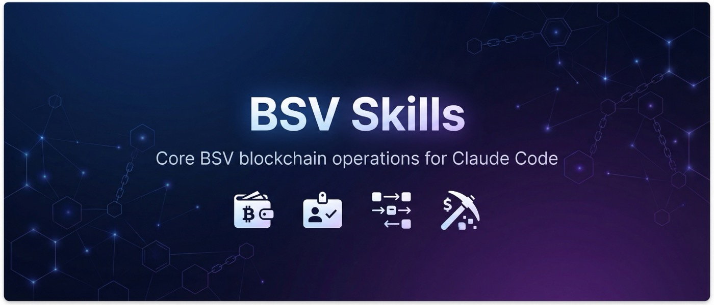

BSV blockchain operations for Claude Code. 24 skills covering wallets, identity, transactions, and protocol implementation.

## Installation

**Full Plugin** (recommended - includes bitcoin-specialist agent):
```bash
/plugin install bsv-skills@b-open-io
```

**Skills Only** (for other agentic frameworks):
```bash
skills add b-open-io/bsv-skills
```

## Skills

### Wallet Development

**wallet-brc100** / **wallet-brc100-go** - BRC-100 wallet implementation
- TypeScript: `@bsv/wallet-toolbox`, Go: `go-wallet-toolbox`
- Wallet initialization, transaction operations, key management
- Storage configuration, certificate operations

**wallet-send-bsv** - Build and broadcast P2PKH transactions with `@bsv/sdk`

**wallet-encrypt-decrypt** - ECDH encryption/decryption with BSV keys (AES-256-GCM)

### Identity & Authentication

**create-bap-identity** - Create BAP identities via `bap` CLI
- Type42 (BRC-42 derived) or Legacy mode
- Outputs encrypted `.bep` backup files

**manage-bap-backup** - List members, export identities from `.bep` files

**encrypt-decrypt-backup** - Encrypt/decrypt `.bep` backups via `bitcoin-backup` CLI

**message-signing** - Three signing approaches:
- BSM (Bitcoin Signed Message) - simple message auth
- BRC-77 - structured message signing
- Sigma Protocol - transaction-bound signatures

### Standards Reference

**bsv-standards** - BRC specifications, BitCom protocols (MAP, AIP, B, SIGMA), token standards, identity protocols

**key-derivation** - BRC-42 (Type42), BRC-32 (BIP32), BAP derivation patterns

**ordfs** - ORDFS gateway API for on-chain content (`ordfs.network`)

### Script Templates

**create-script-template** - Author new `ScriptTemplate` implementations for `ts-templates`

**review-script-template** - Audit template code against best practices

### Mining

**stratum-v1** - Stratum v1 protocol (JSON-RPC over TCP)
- Connection flow, job assignment, share submission
- Difficulty adjustment, error handling

**stratum-v2** - Stratum v2 binary protocol overview

**calculate-mining-difficulty** - Convert between target, bits, difficulty; analyze network hashrate

### On-Chain Data

**junglebus** - Real-time transaction streaming from GorillaPool
- JavaScript client: `@gorillapool/js-junglebus`
- Go client: `github.com/GorillaPool/go-junglebus`
- REST API for transactions, addresses, block headers

**bsocial** - Complete on-chain social protocol
- Posts, replies, likes, follows, reposts, messages, friend requests
- BitcoinSchema.org standards with B, MAP, AIP protocols
- BMAP API integration for queries

### Utilities

| Skill | Function |
|-------|----------|
| **check-bsv-price** | Current price from WhatsOnChain |
| **decode-bsv-transaction** | Parse transaction hex |
| **validate-bsv-script** | Analyze locking/unlocking scripts |
| **lookup-bsv-address** | Address balance, history, UTXOs |
| **lookup-block-info** | Block data by height or hash |
| **estimate-transaction-fee** | Fee calculation by size and rate |

## Prerequisites

Some skills require CLI tools:

```bash
# For backup operations
bun add -g bitcoin-backup

# For BAP identity operations
git clone https://github.com/b-open-io/bap-cli.git
cd bap-cli && bun install && bun run build && bun link
```

Set `BACKUP_PASSPHRASE` environment variable for backup encryption.

## License

MIT
